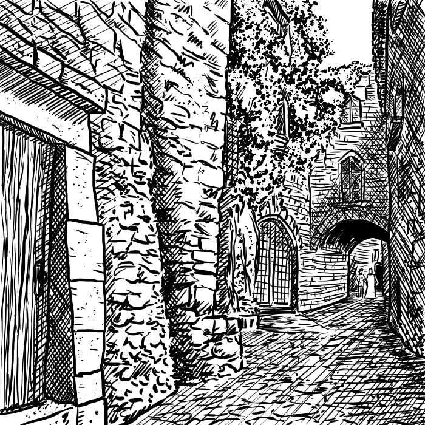

## 2. Città

Quando progettate un nuovo "castello", il vostro scopo principale è quello di dare ai vostri giocatori una base per le operazioni dove tutto l'equipaggiamento necessario per le esplorazioni di dungeon e terre selvagge possa essere acquistato, ed un posto dove i personaggi possano soggiornare in (relativa) sicurezza tra le avventure.

### I primi passi

Il miglior modo per far questo, a parte dare direttamente l'equipaggiamento ai giocatori, e creare un piccolo avamposto o villaggio (o una piccola città per chi ha ambizione e fogli di carta in abbondanza). In questo modo non solo darete ai vostri giocatori una base, ma potranno essere coinvolti in "avventure cittadine" per rompere la monotonia delle esplorazioni nei dungeon, senza rischiare di rompersi il collo in avventure nelle terre selvagge.

Se una città vi sembra tanto lavoro, potete creare un tipo di diverso di base operativa. Ad esempio, in un castello, il primo livello potrebbe essere dato in gestione a locandieri e negozianti.

In ogni caso, una delle prime decisioni da dover essere presa è la vendita di oggetti magici. Teoricamente, molti di questi oggetti dovrebbero essere scambiati, e non venduti (tipo, un mago potrebbe non aver bisogno di uno scudo magico, e potrebbe essere interessato ad una pergamena). In ogni caso, chi commercia in oggetti magici dovrebbe essere abbastanza potente per evitare che gli oggetti possano essere estorti con la forza. Considerate l'idea di creare una piantina completa dell'emporio in questione. Gli oggetti magici devono essere venduti a molto più del loro valore reale: il personaggio non giocante deve guadagnare dei soldi, non solamente aiutare i personaggi dei giocatori.
Un altro posto da considerare è il pub (o osteria). Qua i personaggi, al costo di un giro di bevute, possono scoprire le ultime notizie e, più importante, le leggende locali. Ovviamente l'arbitro deve decidere prima se vuole legende nella sua partita. In caso affermativo, è interessante aggiungere delle leggende "spazzatura", in modo tale da renderli più sospettosi su quello che sentono dire in giro.

È una buona idea creare una mappa approssimativa di due o più locali: può capitare che i vostri giocatori possano venire espulsi dal locale perché clienti difficili in caso di ubriacatura (i boccali di sidro si sommano...) e perché proni alla rissa ("Sono innocente, davvero! Se lui non mi avesse chiamato figlio di bugbear...).

Un altro motivo per avere diversi locali è la possibilità di differenziarne gli avventori: ad esempio, una taverna potrebbe essere preferita da razze semiumane come nani, elfi e halfling. Un'altra taverna potrebbe essere meta di mercanti umani, un'altra ancora luogo di ritrovo per chierici. Comunque, il manuale de *La Scatola Bianca - Regole Avanzate* dispone di tabelle per la generazione casuale degli avventori.

Nel caso decidiate per un villaggio come punto iniziale della vostra campagna, dovreste creare una piccola mappa su carta esagonale dei dintorni, con l'ingresso (o gli ingressi) del dungeon. La scala dipende da quanti dettagli volete aggiungere in questa fase. In questo modo, potete creare dungeon con più di un ingresso, e i giocatori possono, se voglio, e quando avranno oro a disposizione, scegliere un'area e creare le loro roccaforti.

### Le Caratteristiche principali

La parte successiva è, praticamente, decidere alcune caratteristiche della città.
Popolazione, tipo di città (normale, fortificata, portuale, capoluogo, etc.…), allineamento del governo, e così via.
Allo stesso tempo, ogni personaggio non giocante presente in città dovrebbe essere appuntato, insieme agli oggetti speciali e magici che potrebbe possedere. 
Una volta completate queste operazioni, la prossima mossa sarebbe quella di mappare l'insediamento stesso. Dovrebbe essere fatto su carta quadrettata, ogni quadretto equivalente a venti piedi (anche se questa scala può essere modificata per le città più grandi). E, per chiarezza, dovresti usare diversi simboli o colori.
Prima dovresti creare le mura dell'insediamento, elementi d'acqua, e caratteristiche fisiche al di fuori delle mura.
Se stiamo parlando di una città abbastanza grande, considera se dotarla di mura fortificate. Questo è molto probabile nel caso si trovi nel confine con un regno ogni tanto ostile, oppure vicino ad un corso d'acqua o una strada commerciale. Inoltre, considera che ogni città deve avere vicino o dentro la città stessa una fortezza con la sede del suo signore e delle guardie.
Il terreno intorno alla città deve avere sia una fonte d'acqua che dei terreni coltivabili per il sostentamento dei cittadini. In base alla posizione della città (nella costa di un mare o di un lago, arroccata in una montagna o circondata da foreste), le avventure nei dintorni saranno dipendenti da questa posizione, così come anche l'economia.

Prima dovrebbe essere fatto a matita, e successivamente a colori quando sei soddisfatto del tuo lavoro.
Successivamente, vanno disegnati i muri interni, come quelli dei palazzi. Fai in modo che siano diversi dalle mura esterne.

Gli edifici stessi non devono essere larghi, o con stanze spaziose. Molte case e negozi medievali erano piccoli e consistevano di poche stanze. Un quartiere può essere composto da diverse residenze e botteghe, così come nella realtà. Mappate i secondi ed i terzi piani su fogli diversi. Molto spesso non servirà creare piani ulteriori al piano terra, ma comunque non create edifici più alti di tre piani, fatta eccezioni per templi grandi o torri molto alte.

Dopodiché, se la città è grande abbastanza, puoi dividerla in sezioni (il quartiere dei ladri, la zona del tempio, il distretto della gente comune, etc.…) e creare ciascuna sezione una alla volta. Prima, gli edifici principali (templi, palazzi, gilde, etc.…). Per alcuni di questi palazzi vorresti creare degli ingrandimenti in mappe separate. Poi, in ordine, strade principale, strade secondarie, negozi, vicoli ed infine le case del popolo comune.
Ricorda di usare il tuo senso comune. Una banca non dovrebbe stare nel quartiere dei ladri, o il palazzo reale non dovrebbe stare nel distretto della gente comune.

### I distretti

Alcuni negozi che potrebbero interessare i nostri avventurieri, nel distretto dei mercanti:

-   Armaioli - Vendono, riparano e adattano armature ed armi.
-   Ciabattini - Scarpe e stivali.
-   Cartografi - Mappe delle aree selvagge e di dungeon da 100 a 600 PO, dipendente dall'estensione, dalla precisione e dalla lontananza della zona indicata.
-   Candelai - Torce, ferri da marcatura, incensi, candele.
-   Tessitori - Tuniche, calzoni, camicie, mantelli, coperte.
-   Barbieri - Barca e capelli per un PO.
-   Banco di pegni - Vende e compra Armature e armi a meno del loro valore, ma hanno una probabilità su sei di essere difettose. Può trattare anche oggetti magici. 

Altri artigiani come soffiatori di vetro, pittori, scultori, muratori possono essere inclusi se la città è grande abbastanza.
Sicuramente, nella città dev'esserci una piazza centrale che serve come mercato all'aria aperta. Cibo, vino, borse, corde, utensili comuni in metallo e legno, e magari qualche piccolo oggetto magico. Se vuoi, può esserci una probabilità su quattro che un mercante forestiero possa avere della merce particolare o notizie e dicerie da posti lontani. Potrebbe essere interessato a guardie per una carovana o ranger come guide. Qualche volta potrebbe avere con sé qualcosa di veramente bizzarro: un artefatto, un drago sottomesso, etc...
Il mercato è un ottimo luogo per sentire notizie e dicerie locali, di cui una buona parte false. È un luogo di incontro per la gente comune, e quando i personaggi si recano qui, assicuratevi che sentano frammenti di notizie, sia che siano vere o no.
Vicino le strade che portano alla città, dovrebbero esserci delle scuderie (dove tenere i cavalli per 2-3 PO la settimana), un fabbro, un fabbricante di carrozze e carretti. Dovrebbero essere disponibili dei cavalli, siano essi in vendita o in affitto.

Se il tuo insediamento si trova in una costa, assicurati che abbia un porto, con pescherecci e navi mercantili assoldabili, o alla ricerca di equipaggio o marinai. E ricorda di far raccontare a questi vecchi lupi di mare storie terribili di mostri e favolose terre oltremare (o di strane isole create apposta dall'arbitro). Ovviamente, non per forza queste storie devono essere vere. Il porto poi è un luogo perfetto per incontrare forestieri e visitatori. Oltre ad una taverna portuale, non può mancare il mercato del pesce, un fabbricante di vele, e magari un negozio specializzato in carte nautiche e strumenti per la navigazione.

Un altro distretto importante è il quartiere altolocato, dove ricchi guerrieri, mercanti e banchieri hanno le loro residenze. Queste case sono ben costruite e protette da guardie, perché sicuramente piene di tesori.

Sia un distretto a parte, o raggruppati vicino la piazza, bisogna posizionare dei templi. Da considerare un buon numero di chierici ed attendenti che gestiscono questi luoghi, più chierici di alto livello a capo di questi posti. I chierici del vostro gruppo di giocatori dovrebbero trovare questi luoghi interessanti. Questo dovrebbe far sentire ancora di più i vostri giocatori parte integrante della città. Se l'arbitro lo desidera e ha il tempo per farlo, può lavorare alle religioni del mondo di gioco. I templi dovrebbero essere grandi, ornati e con qualche tesoro in particolare.

La parte più interessante è stata lasciata per ultima. Nelle zone più oscure della città, dove gli uomini onesti non si avventurano mai dai soli (una probabilità su otto ogni turno di incontrare un ladro o essere attaccati da una banda di briganti). Dovrebbero essere presenti almeno una o due taverne, con i loro avventori, baristi e bariste. Non dovrebbe mancare una squallida pensione. Altri punti di interesse potrebbero essere:

-   Indovino - per 20 PO questa donna (o uomo) "scruterà" il futuro riguardante una spedizione o un evento futuro. Una volta che i giocatori avranno dichiarato il loro piano all'arbitro, sarà lui che tramite le sue conoscenze risponderà ai giocatori (sottostando ad un tiro per quanto riguarda l'accuratezza).
-   Mago - Semplicemente un mago non giocante che lancerà degli incantesimi ai giocatori per un prezzo (diciamo sui 50 PO per livello).
-   Casa di piacere - Nessun quartiere dei ladri sarebbe completo senza una di queste. Considerate attentamente se inserire un luogo del genere in base alla sensibilità dei vostri giocatori. In questo luogo spesso molti segreti vengono scambiati (e spesso un incentivo da 10 a 100 PO può aiutare). La tariffa varia dai 20 ai 35 PO. Da uno a sei frequentatori staranno aspettando nella zona di attesa.
-   Piazza - Un luogo aperto dove incontrare ed assoldare spie, assassini e ladri. Anche un buon posto per smerciare e comprare merce trafugata.

Altri luoghi che possono essere creati:

-   Medico - Per 25 PO il dottore proverà a curare un 1d6 ferite (con il 50% di probabilità di successo). Massimo un tiro al giorno, e massimo una cura alla settimana. Il pagamento dev'essere onorato anche in caso di insuccesso.
-   Biblioteca - Un certo numero di studiosi vi si recano per cercare conoscenza tra i tanti tomi del luogo. Il costo di una informazione dovrebbe partire dalle 100 PO in su (le informazioni possono riguardare leggende su certe aree o dungeon o mostri creati dall'arbitro). Potrebbe essere un luogo per incontrare uno scriba, dettagliato in questo stesso manuale al paragrafo 4.1.

L'arbitro dovrebbe tenere l'elenco delle attività create nei suoi appunti. Potrebbe anche aggiungere gli indirizzi per un tocco di realismo, così come un paio di frasi che descrivono gli interni per aggiungere colore, così come informazioni sul proprietario, sui visitatori tipo e dal loro numero. Così, quando i giocatori entrano in questi posti, l'arbitro deve fare di tutto per farli sentire veri.

### La popolazione

Una volta definiti gli aspetti fisici della città, passiamo alla popolazione. Non serve creare le schede di ogni singolo cittadino o negoziante, ma create degli archetipi in base al loro lavoro o storia. Se proprio volete marcare la differenza degli avventurieri rispetto al normale cittadino, le loro statistiche possono essere tirate con 4d4 al posto dei canonici 3d6.
Qui di seguito delle tabelle per tirare delle caratteristiche dei vostri cittadini.

#### Tabella 1.2.1: Allineamento del cittadino

| Tiro (1d6) | Allineamento |
| :--------: | :----------: |
|      1     |     Chaos    |
|     2-3    |   Neutrale   |
|     4-6    |     Legge    |

#### Tabella 1.2.2: Livello del cittadino

| Tiro (1d6) | Livello |
| :--------: | :-----: |
|     1-3    |    1    |
|      4     |    2    |
|      5     |    3    |
|      6     |   1d8   |

#### Tabella 1.2.3: Età del cittadino

| Tiro (1d6) |     Età\*     |
| :--------: | :-----------: |
|     1-3    |    Giovane    |
|      4     |    Mezz'età   |
|      5     |    Vecchio    |
|      6     | Molto vecchio |

\* = Aggiungere +1 al tiro per ogni due livelli oltre il secondo: aggiungere inoltre +1 se la classe è Mago.

#### Tabella 1.2.4: Personalità del cittadino

| Tiro (1d6) |          Personalità          | Modificatore di morale |
| :--------: | :---------------------------: | :--------------------: |
|      1     |             Odioso            |           -2           |
|      2     |         Non amichevole        |           -1           |
|      3     |             Neutro            |            0           |
|      4     |           Amichevole          |            0           |
|      5     |    Cooperativo, amichevole    |           +1           |
|      6     | Molto cooperativo, amichevole |           +2           |

#### Tabella 1.2.5: Iniziativa del cittadino

| Tiro (1d6) | Iniziativa |
| :--------: | :--------: |
|      1     |    Bassa   |
|     2-5    |    Media   |
|      6     |    Alta    |

#### Tabella 1.2.6: Lealtà del cittadino

| Tiro (1d6) | Lealtà | Modificatore lealtà |
| :--------: | :----: | :-----------------: |
|      1     |  Bassa |          -2         |
|      2     | Sleale |          -1         |
|     3-4    |  Media |          0          |
|      5     |  Leale |          +1         |
|      6     |  Alta  |          +2         |

La tabella iniziativa indica l'atteggiamento del personaggio rispetto alle situazioni che si susseguono: un personaggio con iniziativa bassa non eseguirà nessuno azione se non istruito apposta, mentre un personaggio con iniziativa altra potrebbe addirittura diventare il leader del gruppo se i giocatori lo permettono.

Una volta creato il personaggio, puoi aggiungere dettagli come "Adora la taverna del Calice Dorato, gli piace raccontare storie con lui protagonista durante la Guerra dei Goblin, e non dice di no ad un bicchiere di Sidro".
Con questi dettagli, il vostro personaggio è un po' più reale.

Ricordate, se questo personaggio dovesse interagire in maniera approfondita con i vostri giocatori, ed essere un mercante o offrire dei servizi, date un'occhiata alle tabelle nel paragrafo 2.2.

Usando questi suggerimenti, potrete creare delle città stupende da esplorare, e ben meritevoli di qualche sessione di gioco.