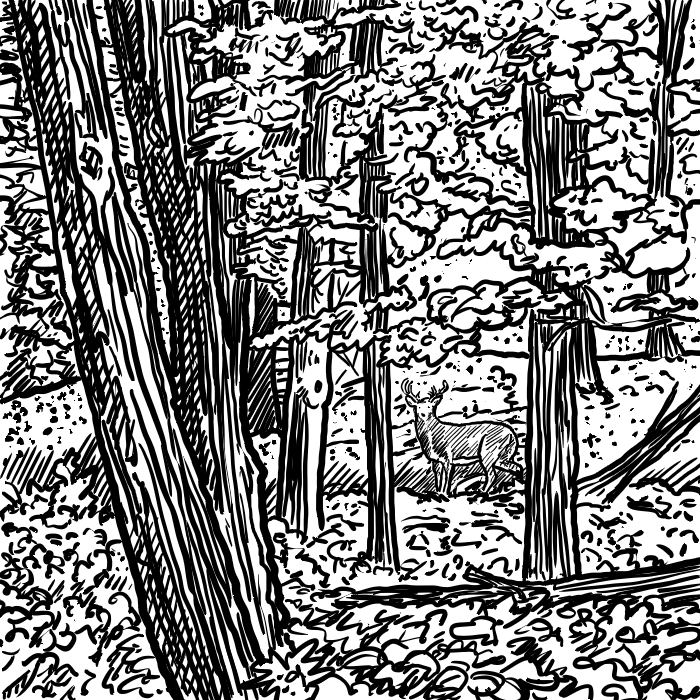

## 3. Aree Selvagge

Probabilmente uno dei motivi principali che impedisce agli arbitri di passare da un buon dungeon ad un'ottima campagna è la mancanza di una zona selvaggia. Dopo aver visto come creare un insediamento, qua spiegheremo come crearne le aree circostanti, costruire altre città, baronati, regni, addirittura interi continenti pieni di mostri, tesori e avventure.

### Creare la mappa

Ci sono molti modi per creare delle mappe, qui ne verranno dettagliati i tre più usati.

1.  Il primo metodo potrebbe essere semplicemente creare una mappa per uso esclusivo dell'arbitro; in questo modo, ogni area speciale può essere indicata semplicemente.
2.  Il secondo metodo prevede che venga usata una sola mappa, ma viene mostrata ai giocatori durante ogni avventura di esplorazione. Questo significa non poter marcare i punti speciali da tenere nascosti ai giocatori. In questo caso, è meglio creare un sistema di coordinate, e indicare in un foglio a parte eventuali luoghi o eventi speciali. Basterà controllare ad ogni movimento se i giocatori si sono imbattuti in uno di questi luoghi speciali.
3.  Il terzo metodo è forse il più difficile, ed allo stesso tempo interessante per i giocatori e divertente per l'arbitro. Richiede due mappe: una dettagliata con tutti i tesori ed aree speciali, ad uso del solo arbitro, ed una mappa più vaga che mostri solo elementi fisici importanti come fiumi e montagne, e città, e non per forza devono coincidere con la mappa dell'arbitro: questa mappa rappresenta infatti le informazioni che i personaggi conoscono dalle poche informazioni che si possono recepire dagli abitanti dell'insediamento nel quale si trovano.

Per le prime volte è meglio non esagerare: mappate soltanto il baronato, la ducea o un'area di dimensione simile. La mappa verrà dettagliata, ma non saranno necessarie molte idee per aree particolari, (in fondo, quante aree particolari saranno presenti in un tipico baronato?), e potrete spendere più tempo nel dettagliare le varie zone (È meglio usare pennarelli colorati e carta esagonale per il prodotto finale, ma per il prototipo può andare bene anche matita e carta quadrettata).
Nonostante questo sia un gioco fantasy, e tutto può accadere, evitate di inserire paludi in cima alle montagne, e fiumi che scorrono su e giù per le colline. E considerando che l'area che state mappando non sarà più grande di 40 miglia per 40 miglia, almeno al vostro primo tentativo, sarà praticamente un tipo solo di terreno con pochissime variazioni (es. Mappando una piccola baronia, la maggior parte sarà terreno adibito a pascolo, con un piccolo fiume attraverso la mappa, qualche piccolo bosco e qualche foresta, ed una regione collinare nel confine est, che anticipa una regione montuosa più impervia, più ad est).

### I dettagli

Prima di iniziare a disegnare la mappa, dovresti prima decidere alcune cose: la scala della mappa, il tempo trascorso durante ogni turno, e la velocità di movimento dei giocatori. Prima di decidere, dai un'occhiata ai manuali de *La Scatola Bianca* (o del tuo regolamento scelto): in essi vi è riportata la velocità di movimento in base e penalità per terreni difficili. Potrete quindi precalcolare la velocità di movimento, il turno e la scala.
Adesso, puoi iniziare a lavorare sulla mappa. Dovresti già avere una mappa del circondario del tuo insediamento e degli ingressi del dungeon. Dovrebbe essere piazzata al centro della mappa (potrebbe non essere necessario per mappe più grandi, ma dovrebbe essere comunque possibile per i giocatori avventurarsi in qualsiasi direzione per un po' prima di incontrare il bordo della mappa). Dopodiché puoi riempire il resto della mappa. Qui viene riportato una possibile legenda per la tua mappa:

-   Blu - Acqua (differenti gradazioni possono indicare differenti profondità)
-   Verde chiaro - Pascolo
-   Verde scuro - Boschi, foreste, etc...
-   Verde acqua - Paludi
-   Giallo - Deserto
-   Marrone chiaro - Colline
-   Marrone scuro - Montagne
-   Rosso - Strade principali
-   Arancio - Strade secondarie
-   Nero - Città, insediamenti, villaggi

Si possono usare questi simboli per distinguere gli insediamenti:

-   Triangolo - Villaggio
-   Quadrato - Paese
-   Cerchio - Città
-   Crocetta - Fortezza

Inoltre, stelle di diversa dimensione possono indicare capoluoghi o sede di governo. Inoltre, cerchiando il simbolo è possibile indicare un porto di qualsiasi dimensione.
Quando disegni la tua mappa, disegna prima le caratteristiche più importanti. Fiumi, catene montuose, grandi laghi, mari, oceani e così via. Riempi le aree vuote con caratteristiche più piccole, infine piazza città grandi, porti e capitali, continuando verso i villaggi. Finisci la mappa con una rete stradale.
Ricorda, utilizza le tabelle per gli incontri casuali all'aperto. Le terre selvagge non sono un posto sicuro (tranne nelle aree semicivilizzate) e i giocatori che vi si avventurano lo fanno a loro rischio. Nella maggior parte dei casi, solo i giocatori veramente forti o gruppi molto numerosi possono esplorare le lande con delle possibilità di sopravvivenza. Anche gruppi più piccoli possono farcela, ma non per molto.