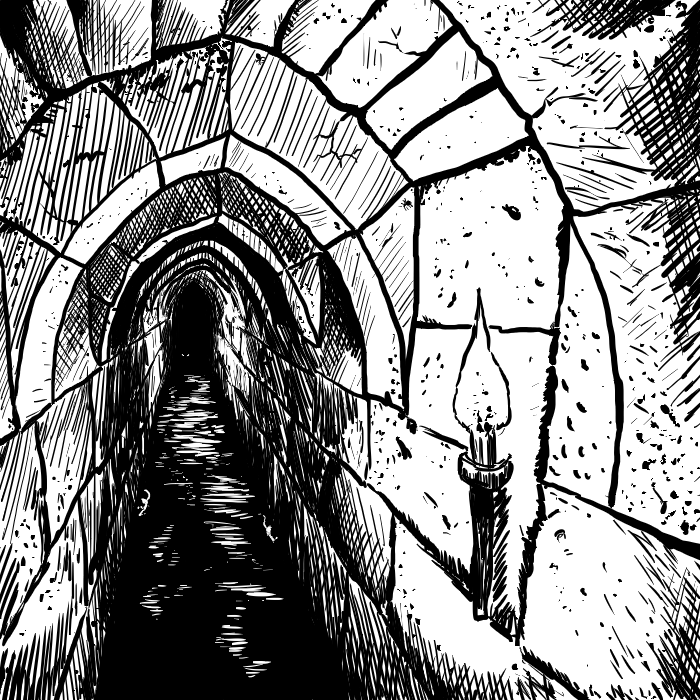

## 5. Buche e Fossi

Anche i migliori avventurieri cadono in delle fosse ben nascoste. Una delle trappole più comuni, che non per forza deve risolversi in un semplice contrattempo. Qui di seguito, ecco delle tabelle che possono aiutarvi a rendere queste semplici trappole in qualcosa di più complesso.

#### Tabella 1.4.1: Tipo di fossa

| Tiro (1d100) |      Tipo     |
| :----------: | :-----------: |
|     01-60    |     Vuota     |
|     61-95    |     Piena     |
|     96-98    | Teletrasporto |
|     99-00    |  Senza fondo  |

#### Tabella 1.4.2: Fosse piene

| Tiro (1d100) | Contenuto della fossa |
| :----------: | :-------------------: |
|     01-35    |        Aculei\*       |
|     35-65    |    Animali/Insetti    |
|     66-70    |     Teletrasporto     |
|     71-90    |         Mostro        |
|     91-00    |        Speciale       |

\* = 40% di probabilità che siano velenosi

#### Tabella 1.4.3: Animali/Insetti

| Tiro (1d100) | Animali/Insetti presenti nella fossa |
| :----------: | :----------------------------------: |
|     01-35    |              Serpenti\*              |
|     36-45    |              Lucertole\*             |
|     46-55    |          Sanguisughe Giganti         |
|     56-70    |          serpenti giganti\*          |
|     71-85    |            donnole giganti           |
|     86-00    |  millepiedi giganti, sempre velenosi |

\* = 40% di probabilità che siano velenosi

#### Tabella 1.4.4: Mostri

| Tiro (1d100) |            Mostri presenti nella fossa            |
| :----------: | :-----------------------------------------------: |
|     01-50    | Una Gelatina, Melma, Muffa o un Sanguinaccio Nero |
|     51-00    |     Tira sulla tabella degli incontri casuali     |

Se venisse incontrato un mostro, esso potrebbe avere il suo tesoro con sé. Alcuni mostri intelligenti grandi (come i giganti) potrebbero aspettare i malcapitati con un pentolone d'acqua in ebollizione! Inoltre, alcuni fossi potrebbero essere l'unica apertura per entrare ed uscire da una stanza abitata dal mostro.

#### Tabella 1.4.5: Speciale

| Tiro (1d100) |                                                 Speciale                                                |
| :----------: | :-----------------------------------------------------------------------------------------------------: |
|     01-40    |                                      Cittadino legato o incatenato                                      |
|     41-80    |                                     Specialista legato o incatenato                                     |
|     81-00    | Mostro legato o incatenato, se liberato, 50% di probabilità che sia amico, oppure tiro sulla reazione\* |

\* = Se lo si desidera, si può decidere il comportamento del mostro incatenato con questa tabella:

#### Tabella 1.4.6: Tabella reazione alternativa

| Tiro (1d6) |                                                 Reazione                                                 |
| :--------: | :------------------------------------------------------------------------------------------------------: |
|      1     |              Estremeante entusiasta, aiuterà il party fedelmente per i prossimi 1d20 giorni              |
|      2     |                 Come sopra, ma terrà celate le sue intenzioni fino a quando non liberato                 |
|     3-4    |           Indeciso, se liberato tirare un 1d6: 1-4 sarà leale, 5-6 fuggirà alla prima occasione          |
|      5     | Nessuna reazione fin quando non verrà tirato fuori dal fosso: tirare un 1d6: 1-4 attaccherà, 5-6 fuggirà |
|      6     |                                         Attacherà appena liberato                                        |

In ogni caso, un mostro liberato che non venisse aiutato ad uscire attaccherà sempre. Inoltre, un mostro non liberato ricorderà la faccia degli avventurieri che non lo hanno aiutato, e cercherà vendetta.

#### Tabella 1.4.7: Cittadino

| Tiro (1d12) | Cittadino dentro la fossa |
| :---------: | :-----------------------: |
|      1      |   Coltivatore di tabacco  |
|      2      |   Costruttore di barche   |
|      3      |         Cappellaio        |
|      4      |     Mercante di birra     |
|      5      |          Scultore         |
|      6      |         Pescatore         |
|      7      |           Fabbro          |
|      8      |   Mercante di strumenti   |
|      9      |      Mercante d'armi      |
|      10     |         Insegnante        |
|      11     |         Strozzino         |
|      12     |         Cacciatore        |

#### Tabella 1.4.8: Specialista

| Tiro (1d10) | Specialista dentro la fossa |
| :---------: | :-------------------------: |
|    01-15    |             Mago            |
|    16-50    |          Guerriero          |
|    51-60    |           Chierico          |
|    61-70    |            Ladro            |
|    71-75    |          Alchimista         |
|    76-80    |            Druido           |
|    81-85    |            Monaco           |
|    86-90    |          Assassino          |
|    91-85    |            Ranger           |
|    96-00    |            Scriba           |

Gli specialisti non avranno nulla di valore con sé.

\newpage