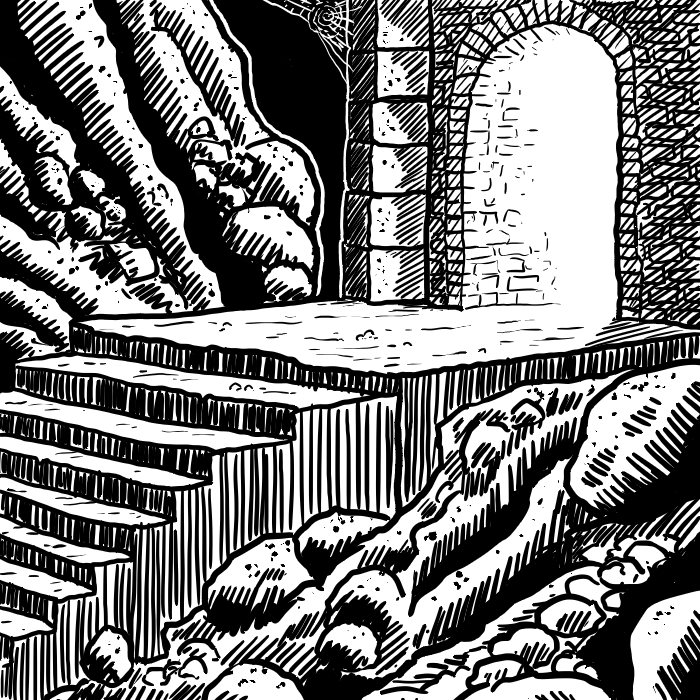

# PARTE I - Creare

In questa prima parte vedremo degli strumenti per la creazione di avventure, personaggi e mostri.

# Capitolo 1 - Avventure

Per quanto la mente di un arbitro sia piena di nuovi tipi di trappole, mostri e tesori da scagliare contro i giocatori, a volte mancano le idee per iniziare una nuova campagna o avventura. Questa serie di paragrafi viene in vostro soccorso per aiutarvi sia all'inizio che nel proseguo della vostra avventura.
