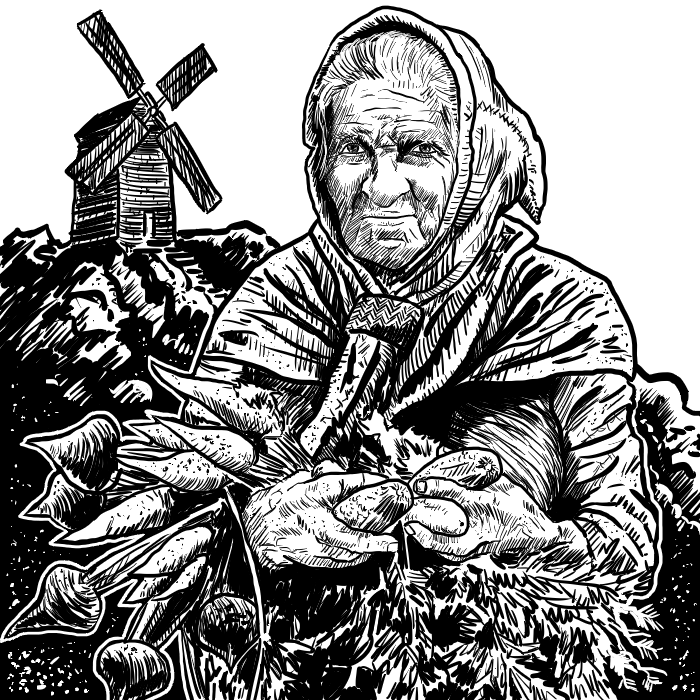

## 2. Non Giocanti

Uno degli aspetti su cui spesso non ci si sofferma, e il carattere dei personaggi non giocanti. Molte campagne hanno negozianti, esperti, gregari e altri cittadini, a volte può essere necessario creare una psiche un po' più complessa. È capita talvolta che questi personaggi siano avari (o generosi) quanto l'arbitro stesso. Per evitare che succeda questo, qui di seguito sono indicate alcune tabelle che possono essere d'ispirazione, tirando un 1d100 oppure scegliendo il carattere che corrisponde alla vostra idea per un personaggio non giocante:

#### Tabella 2.2.1: Orgoglio (Ego)

| Tiro (1d100) |          Orgoglio          | Costituzione\* | Carisma\* | Avarizia | Qualità del lavoro |
| :----------: | :------------------------: | :------------: | :-------: | :------: | :----------------: |
|      01      |           Nessuno          |       -1       |     -1    |    -15   |         -5         |
|    02 - 07   |            Poco            |        -       |     -     |    -10   |         -1         |
|    08 - 13   |           Un po'           |        -       |     -     |    -5    |          -         |
|    14 - 89   |           Normale          |        -       |     -     |     -    |          -         |
|    90 - 91   |    Superiore alla media    |       +1       |     +1    |     -    |          -         |
|    92 - 93   | Molto superiore alla media |       +1       |     -     |    +5    |         +1         |
|    94 - 98   |          Vanitoso          |       +1       |     -1    |    +10   |         +2         |
|      99      |           Egoista          |       +1       |     -2    |    +15   |          -         |
|      00      |         Egocentrico        |       +1       |     -3    |    +20   |          -         |

\* = Modificatori

#### Tabella 2.2.2: Avarizia

| Tiro (1d100) + (1d20) + Modificatori |                  Avarizia                  |       Prezzi di listino o di prestazioni       |
| :----------------------------------: | :----------------------------------------: | :--------------------------------------------: |
|                  \<0                 |                  Generoso                  | Se deve vendere, vende ad un decimo del valore |
|                   0                  |                  Generoso                  | Se deve vendere, vende ad un quinto del valore |
|                1 - 20                |               Presta oggetti               |             Vende a metà del valore            |
|                85 - 95               |  Può prestare oggetti (2 probabilità su 3) |              Vende al loro valore              |
|             96 - 00 + 04             |  Può prestare oggetti (1 probabilità su 3) |                Aumentati del 10%               |
|             00 + 05 - 09             |  Può prestare oggetti (1 probabilità su 6) |                Aumentati del 20%               |
|             00 + 10 - 14             | Può prestare oggetti (1 probabilità su 12) |                Aumentati del 50%               |
|             00 + 15 - 17             | Può prestare oggetti (1 probabilità su 20) |              Aumentati del doppio              |
|             00 + 18 - 19             |             Non presta oggetti             |               Aumentati del 250%               |
|              00 +     20             |             Non presta oggetti             |              Aumentati del triplo              |

#### Tabella 2.2.3: Qualità del lavoro

| Tiro(1d100)  + Modificatori |                                  Qualità del lavoro                                 |
| :-------------------------: | :---------------------------------------------------------------------------------: |
|             \<1             |             Spazzatura, si rompe dopo 1d6 usi, vale un decimo del prezzo            |
|            1 - 20           |     Economico, si rovina in metà del tempo, vale da un quinto a metà del prezzo     |
|           21 - 99           |                                       Normale                                       |
|             100             | Resistente, dura il doppio del normale, vale fino a due volte e mezzo il suo prezzo |

La qualità del lavoro andrebbe ritirata per ogni oggetto venduto.

\newpage