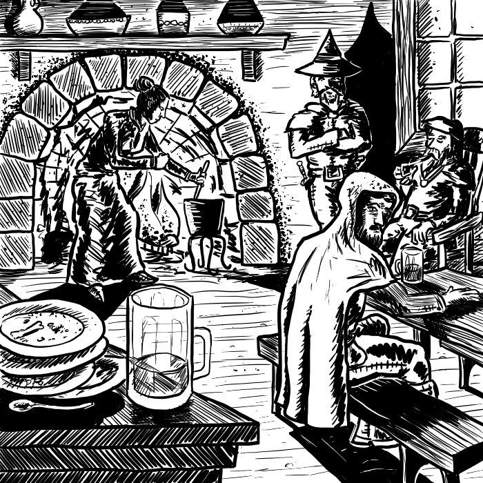

# PARTE II - Giocare

In questa seconda parte vedremo degli strumenti per la gestione delle avventure: approfondimenti regolistici o chiarimenti. Come sempre, l'Arbitro sceglie se applicare queste regole o giocare una partita più "libera". 

# Capitolo 4: Gregari

*La Scatola Bianca* presenta un listino dei possibili gregari che possono unirsi ai giocatori oppure offrire i loro servigi. Qui di seguito alcuni consigli sull'apporto di ciascuno di esso, più un gregario completamente nuovo: lo Scriba.
