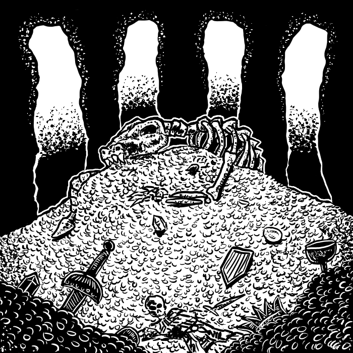

# Capitolo 5 - Gestire Tesori in Eccesso

A volte capita che un gruppo di personaggi sia così fortunato da accumulare un così grande tesoro che i vari costi per l'avventura diventano irrilevanti, ma allo stesso tempo non così tanti soldi da investire in fortezze o abitazioni. Non si può lasciare tutto quell'oro nella stanza di una locanda! Spetta all'arbitro trovare un modo per separare i giocatori dai loro tesori, nel caso si stato molto prodigo durante l'avventura.
Una soluzione è quella di cambiare una piccola regola de *La Scatola Bianca*: "Invece di guadagnare un PE per ogni pezzo d'oro acquisito, si guadagneranno i PE in base al tesoro speso".
Il numero di PE guadagnati equivale al numero di pezzi d'oro spesi diviso il numero di dadi vita massimi della classe dei personaggi (Chierico 8, Guerriero 10 e così via). Questa formula vale solo per l'esperienza legata al tesoro e non all'uccisione dei mostri o punti esperienza assegnati dall'arbitro.
Solo alcune spese fanno guadagnare PE, e dipendono dalla classe del personaggio (vengono presentati degli esempi in seguito). Fondi spesi per la manutenzione e l'acquisto dell'equipaggiamento, gregari e altre spese di servizio non contano per l'esperienza. Neanche spese di lusso (sistemazioni sfarzose, castelli o similari) o investimenti contano per il guadagno di PE; eventuali soldi guadagnati grazie a queste spese possono a loro volta usati per spese legate alla classe e quindi al guadagno di PE. I gregari possono usare il loro salario per aumentare il loro livello, ma i PE guadagnati così sono la metà di un personaggio giocante.

### Spese di esempio

### Sacrifici (tutte le classi)

Il tesoro offerto direttamente ad una divinità, un demone o ad un suo rappresentante. Questa offerta dev'essere fatta una volta alla settimana, ed entro una settimana da quando è stato guadagnato il tesoro (ovviamente ci sono casi particolari in cui si può fare un'eccezione, come nel caso di lunghi viaggi nelle terre selvagge). Queste offerte non possono essere derivate dal pagamento di qualche servizio reso o qualche tangente intascata. Può essere però il tesoro per cui si era partiti in missione. Le decime possono essere considerate sacrifici. A discrezione dell'arbitro, se il sacrificio è 100 PO per livello, il destinatario potrebbe garantire un favore, se non addirittura un desiderio.

### Filantropia (solo legali)

Qualunque somma di denaro donata ai meno fortunati o comunque personaggi non giocanti (non gregari dei giocatori). Deve esistere un vero motivo per effettuare la donazione, e questi soldi non possono essere dati come pagamento per un servizio o per corrompere. Se non esiste un motivo valido per dare donare dei pezzi d'oro, i soldi possono essere donati al tempio Legale locale. A discrezione dell'arbitro, se è stato donato un grande quantitativo di denaro, tirare sulla tabella di reazione.

### Ricerca magica (solo maghi e utilizzatori di magia)

Fino ad un massimo di 250 PO per livello al giorno possono essere usati per "ricerche magiche". Le spese per produrre oggetti magici, pozioni e veleni non contano per il guadagno dell'esperienza. Produzione e ricerca non possono essere eseguite insieme.

### Tesori del clan (Nani e popoli con tradizione simile)

Viene riconosciuta esperienza per ogni contributo al tesoro comune del clan di appartenenza. Questo tesoro comune è ben sorvegliato e nessuno può prelevarne per spese personali. Teoricamente, il tesoro non è considerato "in gioco". Per contribuire al tesoro, bisogna andare dove si trova il suddetto tesoro o consegnato a dei guardiani di fiducia.

### Divertimenti (Guerrieri, Bardi, Ladri, e tutti i Caotici)

A queste feste bisogna escludere Cacciatori, Paladini e Monaci. Bagordi a base di vino, canzoni, gioco d'azzardo e altri divertimenti. Bisogna considerare una spesa di massimo 500 PO per livello a notte (250 PO se i punti ferita sono inferiori del 50% del massimo). Il personaggio può divertirsi per quanti notti reputa opportuno, finché rientra nel limite dei suoi punti costituzione. Dopodiché, dovrà riposarsi per altrettante notti.

### Considerazioni

Ricordate che applicando questo sistema, spingerete i vostri giocatori ad uccidere i mostri che incontreranno nel loro cammino. I vostri guerrieri avanzando di livello faranno sempre meglio, al contrario dei ladri. Preparatevi a fare degli aggiustamenti, se lo reputate necessario. Usando questo sistema, non solo rimuoverete del tesoro in eccesso, ma darete ai vostri giocatori alcune importanti scelte, come tra un'arma più performante o dei punti esperienza che li avvicinerebbero al livello successivo. Inoltre, renderete più "vivi" i personaggi dei vostri giocatori con delle azioni al di fuori delle solite avventure.