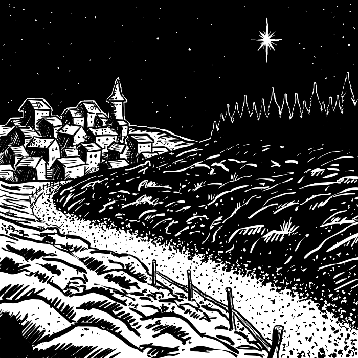

# Capitolo 6: Eventi Casuali in Città

Per quanto gli animali sociali (come gli esseri umani) si aggreghino per cercare mutua protezione, può capitare che tutta una comunità soffra in qualche maniera. Fortunatamente non sono eventi molto comuni. Questa tabella di eventi casuali vuole essere un'ispirazione per l'Arbitro di gioco. I personaggi dei giocatori potrebbero scoprire questi avvenimenti mesi dopo essere avvenuti, o non scoprirlo affatto. Oppure anche solo farne parte. Un evento come un mostro che continua a terrorizzare il villaggio potrebbe essere un'ottima opportunità per un'avventura. Un'invasione da un regno malvagio del nord potrebbe essere la causa per un giocatore per emigrare o unirsi all'esercito. Un modo per usare questa tabella potrebbe essere di tirarla per ogni provincia/feudo di ogni regno. Oppure, anche per ogni villaggio/insediamento/città del regno o impero. Volendo, si potrebbe lanciare su questa tabella per ogni settimana di gioco, anche se si rischia di creare un regno troppo turbolento. In ogni caso, l'Arbitro dovrebbe interpretare i risultati, evitando attacchi da province vicine se le suddette provincie sono tutte amichevoli, oppure oppressione politica in un regno governato da un governo giusto ed equo. In questi casi, siate creativi nel modificare i risultati del tiro, oppure al massimo ritirate.

#### Tabella 6.1: Eventi casuali in città

|                     Tiro (1d100)                     | Primavera | Estate | Autunno | Inverno |
| :--------------------------------------------------: | :-------: | :----: | :-----: | :-----: |
|                     Nessun evento                    |   01-83   |  01-79 |  01-79  |  01-80  |
|                Calore estremo/Siccità                |     84    |  80-81 |    80   |    -    |
|                Tempeste di neve/Bufere               |     -     |    -   |    81   |  81-85  |
|               Forti piogge/Inondazioni               |   85-86   |   82   |    82   |  86-87  |
|                 Tempeste o Terremoti                 |     87    |   83   |    83   |  88-89  |
|     Raccolto scarso/Carestia/Rivolte per il cibo     |     -     |    -   |  84-85  |    -    |
|     Raccolto abbondante/Perturbazioni economiche     |     -     |    -   |  86-87  |    -    |
|    Recessione/Depressione/Inflazione/Sfruttamento    |     88    |   84   |    88   |    90   |
|     Oppressione/Inquisizione/Caccia alle streghe     |     89    |   85   |    89   |    91   |
| Tensioni sociali/Rivolte/Insurrezioni/Colpi di stato |     90    |   86   |    90   |    92   |
|  Tentativi di assassinio/Intrighi/Cambio di regnante |     91    |   87   |    91   |    93   |
|                 Invasioni al confine                 |   92-94   |  88-90 |    92   |    94   |
|             Invasione/Criminalità/Guerra             |   95-96   |  91-92 |    93   |    95   |
|                     Piaga/Epidemia                   |     97    |  93-95 |  94-95  |    96   |
|    Terrore in un villagio (mostri, banditi, etc.)    |   98-99   |  96-98 |  96-98  |  97-98  |
|                   Più di un evento                   |     00    |  99-00 |  99-00  |  99-00  |

\newpage