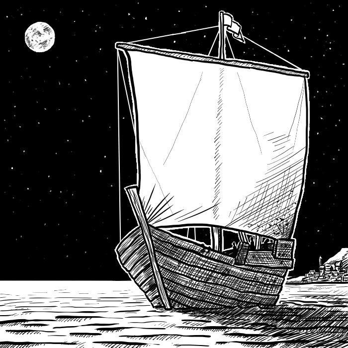

# Capitolo 8: Commercio Marittimo

I personaggi dei vostri giocatori sono arrivati in una fiorente città portuale, con una più che discreta quantità di monete d'oro nella scarsella, e sentono il richiamo del commercio marittimo. *La Scatola Bianca - Regole Avanzate* offrono un capitolo dedicato all'esplorazione marittima, ma un commerciante di successo non può supervisionare personalmente ogni singolo viaggio. Ecco perché viene qui presentato una maniera per regolare l'andamento di una spedizione marittima mercantile. Per comodità, assumiamo una rotta commerciale "lineare", con città portuali messe in successione. Le navi difficilmente si allontaneranno oltre le 50 miglia dalla costa.
Alcuni dettagli dipenderanno dalla vostra campagna ed ambientazione: per questo sottosistema, si considerano 9 città portuali, con le più distanti nella rotta tra loro 2.500 miglia. Usando questo sistema, i vostri giocatori/mercanti proveranno l'ebbrezza di un investimento a lungo termine, senza poter sapere in anticipo l'esito del risultato. 

### Assunzioni

Si considera un carico indefinito, acquistabile e rivendibile in ciascun porto in maniera legale. Una piccola nave mercantile può trasportare massimo 10.000 PO di carico, un mercantile grande fino a 50.000 PO. Ovviamente non bisogna riempire completamente la nave, se il giocatore non lo desidera.

### Spese e tasse

Ogni porto in cui la nave fa scalo, eccetto il porto di partenza del mercantile, richiede che vengano pagate commissioni e spese per un valore di 500 PO per navi mercantili piccole, e 2.500 PO per navi più grandi. Ogni paese ha una percentuale di tasse da pagare riferita al prezzo di vendita del carico. Un valore comune è il 5%.

### Profitti e perdite

La quantità di profitti e perdite viene determinata dal numero di porti saltati nella rotta commerciale e da un tiro percentuale. Più porti vengono saltati, più grandi saranno i profitti o le perdite. In più, aumenteranno anche le possibilità che la nave venga perduta per cause come tempeste, pirati, mostri marini, etc.

#### Procedura

Il giocatore/mercante compra un carico con i suoi fondi personali, e scrive gli ordini al capitano. Questi ordini indicano presso quali porti fermarsi, quale margine minimo di profitto accettare per vendere, quanto carico da comprare prima di salpare, e un tempo massimo prima di far ritorno al porto base. Questo foglio viene dato all'arbitro che determinerà i risultati seguendo questi ordini. Questi risultati sono tenuti nascosti al giocatore finché il personaggio non riceve aggiornamenti, si trova nella stessa città dove il mercantile ha gettato l'ancora, o voci sulla triste sorte del vascello hanno iniziato a diffondersi.
Ricordatevi che non dovete per forza vendere in perdita. Se un carico dovesse essere in perdita (o inferiore alle vostre aspettative di guadagno), il vostro capitano può essere istruito per saltare il porto in questione. In questo caso, il porto viene considerato "saltato", e il prossimo tiro sulla tabella va letto di conseguenza. Se non ci sono indicazioni specifiche, il vostro capitano venderà al prezzo risultante dal tiro.

### Determinare i profitti e le perdite

Una volta ricevuti gli ordini di navigazione, l'arbitro tira il dado percentuale sulla tabella seguente, incrociando il valore di porti saltati. Viene applicato il valore percentuale al carico trasportato, e viene quindi indicato il valore di vendita. A questo bisogna sottrare le spese e le tasse, e possibilmente il costo di un nuovo carico. L’arbitro, quindi, tira 1d4 per determinare il numero di settimane che la nave starà ormeggiata al porto per garantire riparazioni, libere uscite all'equipaggio, compravendita della mercanzia, e così via. La nave riparte secondo gli ordini di navigazione. La procedura si ripete finché la nave raggiunge il porto base o viene perduta. Nel caso di questo tragico evento, la notizia viene riportata al personaggio del giocatore in 1d6+2 settimane. Quando la nave arriva in un porto dove si trova il personaggio, viene notificato immediatamente.

#### Tabella 8.1: Profitti/perdite per porti saltati

Tirare un 1d100, ed incrociare la colonna con il numero di porti saltati

| Tiro (1d100) |   0  |   1  |   2  |   3  |   4  |   5  | 6 +  |
| :----------: | :--: | :--: | :--: | :--: | :--: | :--: | ---- |
|     01-05    |  85% |  80% |  70% |  60% |  50% |  40% | 30%  |
|     06-10    |  90% |  85% |  80% |  70% |  60% |  50% | 40%  |
|     11-15    |  95% |  90% |  85% |  80% |  70% |  60% | 50%  |
|     16-20    | 100% |  95% |  90% |  85% |  80% |  70% | 60%  |
|     21-25    | 105% | 100% |  95% |  90% |  90% |  85% | 80%  |
|     26-30    | 105% | 105% | 110% | 115% | 115% | 120% | 120% |
|     31-35    | 110% | 110% | 115% | 120% | 125% | 140% | 150% |
|     36-40    | 110% | 115% | 120% | 130% | 135% | 160% | 200% |
|     41-60    | 110% | 120% | 130% | 140% | 150% | 200% | 300% |
|     61-65    | 115% | 125% | 150% | 160% | 200% | 300% | 500% |
|     66-70    | 120% | 130% | 160% | 180% | 250% | 400% | X    |
|     71-75    | 125% | 135% | 180% | 200% | 350% |   X  | X    |
|     76-80    | 130% | 140% | 200% | 300% |   X  |   X  | X    |
|     81-85    | 140% | 150% | 250% |   X  |   X  |   X  | X    |
|     86-90    | 150% | 200% |   X  |   X  |   X  |   X  | X    |
|     91-00    |   X  |   X  |   X  |   X  |   X  |   X  | X    |

X = Nave perduta.

Ricordate che una nave perduta non è per forza affondata: la ricerca di superstiti, il recupero del carico o anche solo l'investigare sulle cause della perdita potrebbe essere l'inizio di una nuova avventura marittima.

### Il carico

Il carico di una nave può essere astratto, basta solo conoscerne il valore monetario. Ma se per qualche motivo avete bisogno di dettagliare un carico (anche solo per indicare cosa trovano i giocatori dopo un loro atto di pirateria...), qua di seguito viene indicato un metodo.

Tirate un 1d6 per ogni riga della tabella sottostante. Per ogni 1, esistono 1d6 unità di quel tipo di merce in stiva. La somma di tutte le unità non deve superiore a 12 (per le navi mercantili piccole) o 30 (per le navi mercantili grandi). Se nel tirare il carico avete superato questi limiti, scartate le unità di meno valore.

#### Tabella 8.2: Carico

|      Tipo di merce      | Valore |                               Commenti                              |
| :---------------------: | :----: | :-----------------------------------------------------------------: |
|      Spezie e seta      |  1000  |                                  -                                  |
|     Pietre preziose     |  1000  |          Ambra, pietre focaie, giada, marmo, smeraldi, etc.         |
| Avorio e legni preziosi |   300  |                 1d4 unità; ebano, teak, balsa, etc.                 |
|           Thè           |   350  |                                  -                                  |
|          Cotone         |   250  |                                  -                                  |
|         Gioielli        |  1000  |                     Gioielli non molto elaborati                    |
|          Stoffa         |   250  |                                  -                                  |
|     Animali esotici     |   250  | Cammelli, falchi, pavoni, scimmie, tigri, cavalli del deserto, etc. |
|     Frutta e verdura    |   100  |         Non vengono trovate in navi che fanno lunghi viaggi         |
|         Schiavi         |    -   |                        Dalle 20 a 60 persone                        |

Tirate inoltre sulla tabella "Oggetto Magico Minore".
C'è un 15% di possibilità di trovare dei passeggeri: mercanti, avventurieri e nobili.

\newpage