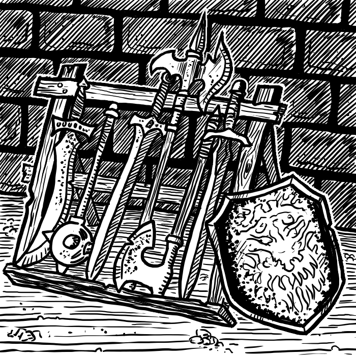

% La Scatola degli Attrezzi

Versione 0.0.1

- A cura di *Alberto Giuffrida*
- Basato sul lavoro di: Joe Fisher, Ronald Guritzky, Tony Watson, James M. Ward, Richard Morenoff, Brad Stock, Brian Lane, P. M. Crabaugh, David Mumper, Jon Pickens, N. Robin Crossby, Robert J. Kuntz, Ronald C. Spencer, Jr., James Endersby, John Carroll, Michael Benveniste, Gary Gygax, George A. Lord, Ernest Gygax e di Italian Translation Alliance.

- Questo prodotto è una pubblicazione indipendente di Alberto Giuffrida e non è affiliato con l'Italian Translation Alliance. 

\newpage

# INTRODUZIONE
Nel 1974 venne pubblicato un *certo* gioco, distribuito in una comoda scatola bianca. Molti arbitri e giocatori dell'epoca vennero abbagliati da un concetto di gioco così innovativo, e in un'epoca pre-internet, spopolarono fanzine e magazine ufficiali pieni di regole, consigli e sottosistemi per un sistema che praticamente era ancora in fasce. Quarant'anni dopo, quella scatola è stata *clonata*, e grazie ai ragazzi dell'Italian Translation Alliance, tradotta in italiano ed impaginata professionalmente. E quegli articoli? Molti vennero pubblicati nei due magazine ufficiali del gioco, il "The Strategic Review" e il "The Dragon". Utilizzando quindi i volumi dell'epoca, alcuni di questi articoli sono stati clonati, nel puro spirito OSR, e tradotti nella nostra lingua. La mia non segreta speranza è quella di aver creato un libro che possa accompagnare i due splendidi volumi già pubblicati, in una sorta di prontuario per chi sta iniziando le sue prime partite OSR (se non addirittura le prime partite ad un gioco di ruolo) e ha bisogno di qualche suggerimento per creare il suo primo Dungeon o la sua prima area selvaggia. Oppure, per chi vuole provare a commerciare via mare, oppure per rispondere al giocatore che vi chiede "non esistono altre magie oltre quelle indicate qui?". Spero di esservi di aiuto, e se volete aggiungere qualcosa voi, ricordatevi che il repository è aperto, potrete creare e pubblicare i vostri capitoli qui.

La "versione" indica appunto quale versione del libro avete con voi, da confrontare con i siti internet ufficiali:

Itch.io: https://alby87.itch.io/la-scatola-degli-attrezzi
GitHub: https://github.com/Alby1987/la-scatola-degli-attrezzi

Il primo numero nella versione indica la versione POD: ogni nuova versione pubblicata partirà con un numero tipo X.0.0, indicante la base.
Il secondo numero indica un aggiornamento a livello regolistico: controllate nei siti internet sopra indicati quali modifiche ci sono state, ed aggiornate a penna il vostro libro stampato o i vostri appunti.
Il terzo numero indica degli aggiustamenti di impaginazione o correzioni ortografiche o sintattiche, nulla di cui dobbiate preoccuparvi.

**Buon divertimento!**

\newpage

\newpage

\toc

\newpage
